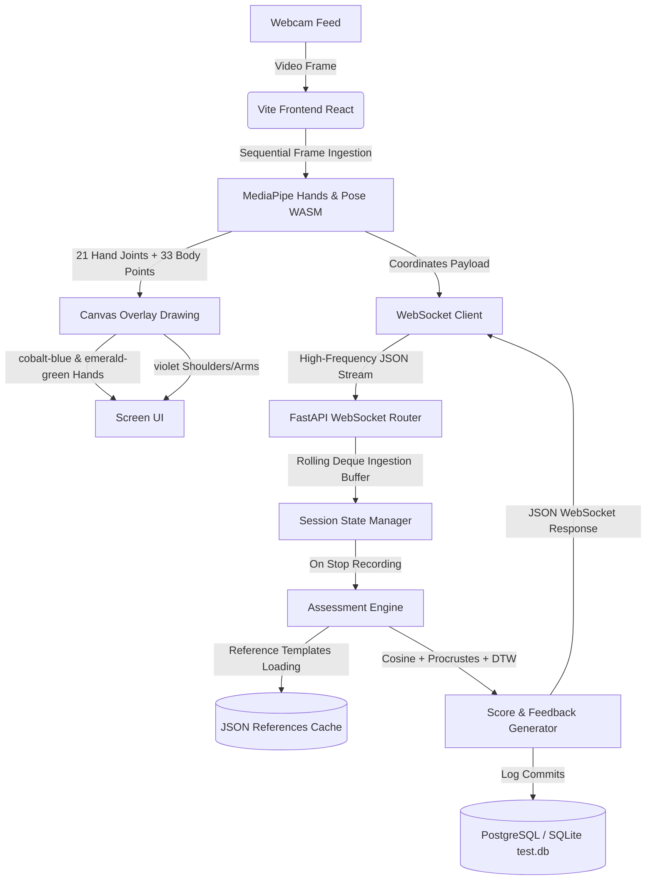

# Milestone 2: Gesture Recognition & Assessment Documentation

This document provides a comprehensive overview of the architecture, database design, pattern recognition algorithms, verification pipelines, and outcomes implemented for **Milestone 2: Gesture Recognition & Assessment**.

---

## 1. System Architecture

The following diagram illustrates the real-time data flow from the client webcam to the backend evaluation engine and storage layers:



### Components:
- **React Frontend**: Manages the webcam capture, initiates MediaPipe WASM libraries, draws the mirrored skeleton overlays, and connects the WebSocket.
- **FastAPI Backend WebSockets**: Establishes lightweight channels to buffer coordinate sequences up to 90 frames (approx. 3 seconds at 30 FPS).
- **Assessment Engine**: Computes similarity scores using mathematical algorithms and performs finger posture vectors checking.
- **Database Fallback Handler**: Commits practice metadata and full time-series coordinates arrays. Fallback logic automatically creates and runs on local SQLite if PostgreSQL is offline.

---

## 2. Database Schema

Practice attempt logs and raw motion series are saved in the `attempt_logs` table.

### Model Definition (`AttemptLog`):
*   `id` (Integer, Primary Key): Unique attempt identifier.
*   `user_id` (Integer, Foreign Key): Reference to the practicing user.
*   `sign_id` (String): ID of the sign (e.g., `'A'`, `'drink'`).
*   `score` (Float): Overall matching accuracy score ($0.0\%$ to $100.0\%$).
*   `is_correct` (Boolean): Flag indicating if accuracy exceeded the $80.0\%$ threshold.
*   `feedback` (Text): Specific joint alignment correction tips.
*   `duration_seconds` (Float): Time duration of the practice attempt.
*   `timestamp` (DateTime): Date and time of the attempt.
*   `landmarks_series` (JSONB / JSON): Array containing the raw coordinates trace of all tracked frames:
    ```json
    [
      {
        "timestamp": 1719600000000,
        "hands": [
          { "hand_label": "Right", "points": [{"x": 0.5, "y": 0.4, "z": -0.1}, ...] }
        ],
        "pose": [{"x": 0.4, "y": 0.8, "z": 0.0}, ...]
      },
      ...
    ]
    ```

---

## 3. Pattern Recognition & Assessment Algorithms

To recognize static alphabet shapes and dynamic gesture sequences, the backend integrates three distinct algorithms under [assessment.py](file:///d:/Infosys%20project/backend/app/services/assessment.py):

### A. Cosine Similarity (Static Signs)
Compares the direction of joint-pointing vectors relative to the wrist.
- Formula: 
  $$\text{Similarity} = \frac{\mathbf{A} \cdot \mathbf{B}}{\|\mathbf{A}\| \|\mathbf{B}\|}$$
- Best for determining if the overall hand shape is correctly formed regardless of the position of the hand in the frame.

### B. Procrustes Shape Analysis (Static Signs)
Finds the minimal difference between two shapes after normalizing them for translation, scaling, and rotation.
- Process: Centroid translation, scale normalization, and Singular Value Decomposition (SVD) rotation mapping.
- Safety: If points collapse to identical coordinates, the engine defaults to a disparity distance of $1.0$ (no match) to prevent mathematical division errors.

### C. Dynamic Time Warping - DTW (Dynamic Sequences)
Aligns temporal sequences of variable lengths to evaluate gestures that change over time (e.g., words like *"drink"*, *"help"*, *"hello"*).
- Process: Finds the optimal path through a distance matrix between candidate frames and reference frames.
- Metric: Accumulates Euclidean distances between aligned hand pose vectors.

### D. Joint Vector Corrective Analysis
If the accuracy score drops below $80.0\%$, the engine calculates pointing vectors for all five fingers:
- Vector: $\vec{\mathbf{v}} = \text{Tip} - \text{MCP Joint}$.
- Angle: Compares candidate finger vector angles to the reference template.
- Output: Returns specific alerts, e.g. *"Adjust position: Pinky joint alignment error"*.

---

## 4. Testing & Verification Pipeline

The verification suite consists of three tools:

### 1. Template Integrity Verification
Checks that JSON template databases load and parse correctly:
```powershell
cd backend
.venv\Scripts\python app/scripts/verify_templates.py
```

### 2. Automated Test Suite (Pytest)
Tests the WebSocket routing, frame buffer parsing, assessment response logic, and database insertion:
```powershell
cd backend
.venv\Scripts\pytest -v
```

### 3. Dynamic Gesture Simulation
Streams coordinates from a reference template directly to the WebSocket to verify that a perfect match evaluates to $100\%$ score:
```powershell
cd backend
.venv\Scripts\python app/scripts/test_dynamic_simulate.py
```

---

## 5. Completed Outcomes

- **Webcam Interface**: Real-time webcam canvas rendering with a Cobalt Blue, Emerald Green, and Violet skeleton overlay.
- **Two-Hand Tracking**: Detects and tracks both hands simultaneously.
- **Camera Controls**: Instant enable/disable switch with custom visual placeholder cards.
- **Evaluation Loop**: Fully operational real-time feedback loops yielding dynamic correctness indicators.
- **Robust Storage**: Automated SQLite fallback database table generator keeping trace history.

---

## 6. Technical Challenges Faced & Solutions

Overcoming several complex engineering issues was key to building this robust, high-performance recognition and assessment system:

### 1. WebAssembly & Emscripten Namespace Clashing
*   **The Challenge**: Instantiating both MediaPipe Hands and MediaPipe Pose concurrently on the same main browser thread caused a WebAssembly abort error (`Module.arguments has been replaced with plain arguments_`). This halted both tracking models completely.
*   **The Solution**: We restructured the camera frame ingestion loop to execute **sequentially** (awaiting `hands.send` before starting `pose.send`). This prevents the two WASM engines from running concurrently, eliminating namespace collisions while retaining dual-model tracking.

### 2. Mirrored Webcam Coordinate Alignment
*   **The Challenge**: To make the webcam feed user-friendly, the video is visually mirrored (`scaleX(-1)`). However, MediaPipe calculates coordinates relative to the raw unmirrored video feed, which caused the skeleton drawings on the canvas overlay to render on the opposite side of the user's actual hand.
*   **The Solution**: We applied coordinate flipping `(1 - pt.x) * canvas.width` during the canvas rendering pass. This aligns the overlays with the mirrored feed visually, while preserving raw coordinates sent to the backend for accurate pattern matching.

### 3. Database Availability & Auto-Migration
*   **The Challenge**: Local environments may not have a PostgreSQL database configured or active, causing connection errors that crash the backend server.
*   **The Solution**: We implemented an active connection check in the backend session engine. If PostgreSQL is offline, it logs a warning, falls back to a local SQLite `test.db` file, and automatically compiles the tables and schemas on-the-fly.

### 4. NumPy Type JSON Serialization
*   **The Challenge**: SciPy and NumPy return numerical and boolean types (such as `numpy.float64` or `numpy.bool_`) that Python's standard `json` library cannot serialize, causing WebSockets to crash when returning assessment results.
*   **The Solution**: We explicitly cast all mathematical similarity scores and correctness booleans to standard Python types (`float()`, `bool()`) before sending them.

### 5. SciPy Procrustes Degenerate Shapes
*   **The Challenge**: The Procrustes similarity algorithm throws a `ValueError` if coordinate points collapse to a single coordinate (e.g. during camera blackouts or mock data inputs).
*   **The Solution**: Wrapped the Procrustes calculation in a `try-except` block to capture exceptions and safely return a maximum disparity distance ($1.0$), ensuring the backend stays online.

