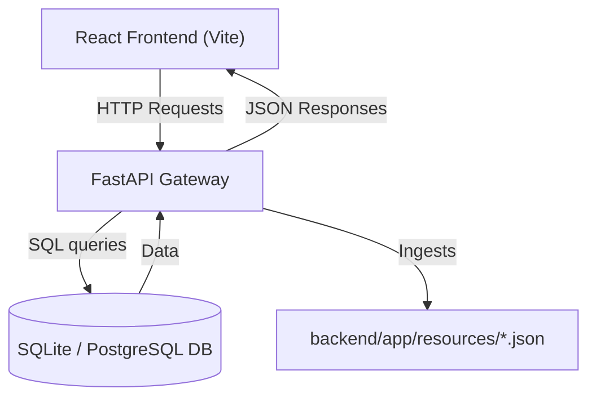
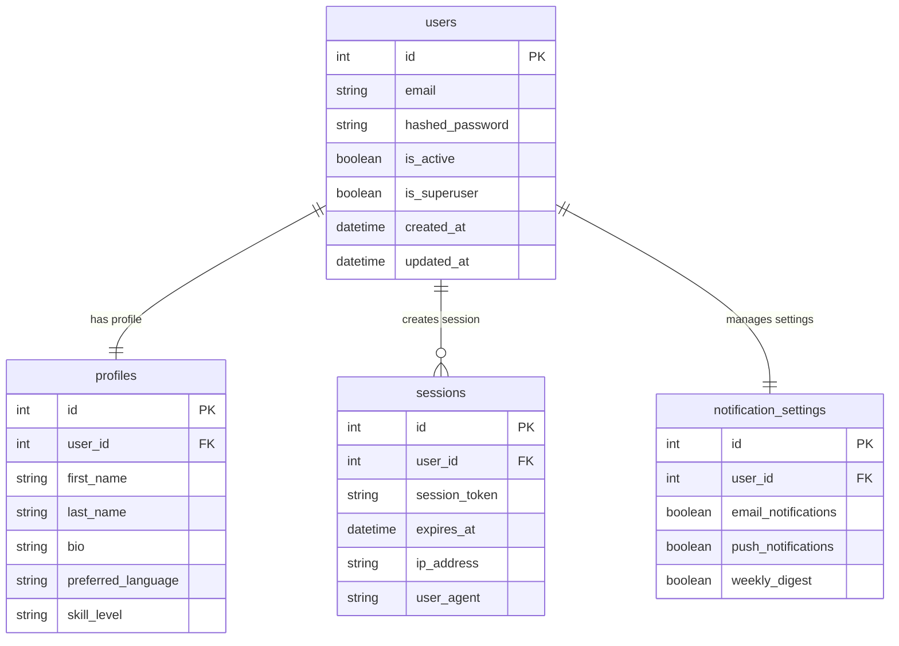
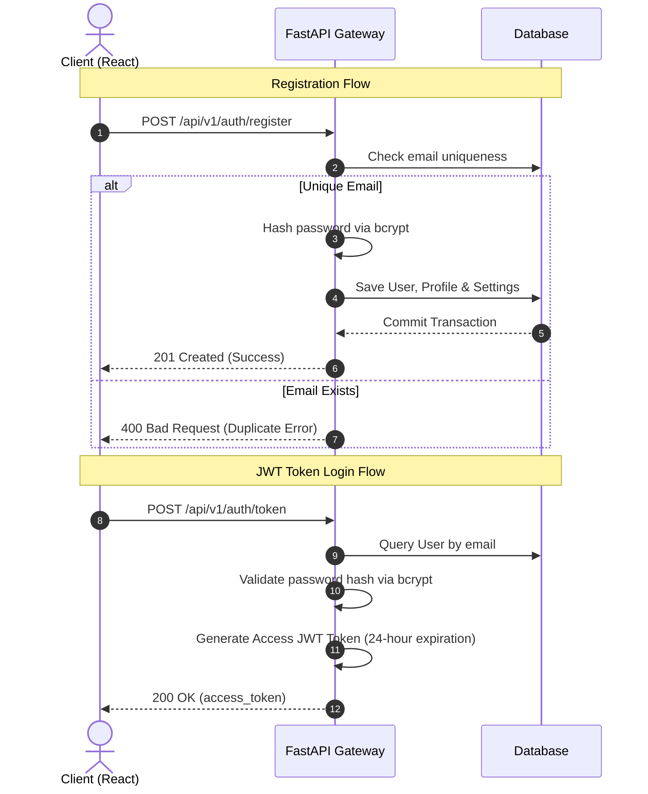

# SignLingo AI: Sign Language Learning & Assessment Platform

SignLingo AI is a modern web application designed to help users master American Sign Language (ASL) with real-time AI-based feedback. 

This repository contains the complete codebase for **Milestone 1: Project Initialization, Design Process & Core Setup**.

---

## 1. System Architecture

The platform follows a decoupled Client-Server architecture pattern:



### Relational Database Model
The relational database structure consists of four core tables:



---

## 2. Authentication & Data Flow

Authentication is built using standard OAuth2 routes with JSON Web Tokens (JWT) and direct `bcrypt` password hashing for optimal database security.



---

## 3. Tech Stack

- **Frontend**: React (v18), Vite, Tailwind CSS, Lucide Icons, React Router DOM.
- **Backend API**: FastAPI (Python 3.11), Uvicorn.
- **Database ORM**: SQLAlchemy (v2).
- **Security & Crypto**: PyJWT, Bcrypt.
- **Unit Testing**: Pytest, HTTPX, FastAPI TestClient.

---

## 4. Milestone 1 Completed Features

### Backend Components
- **Config & Core Settings**: Handled using `pydantic-settings` to dynamically parse environment variables from `.env`.
- **Database Sessions**: Configured database engine routing and connection pooling in `app/db/session.py`.
- **Relational Schemas**: Created model schemas for User accounts, Profiles, Session histories, and Notification preferences.
- **Security Utilities**: Set up token creation utilities and direct bcrypt hashing wrappers in `app/core/security.py`.
- **Auth Routes**: Built and tested endpoint controllers for `/register` and `/token` JWT logins.

### Frontend Components
- **Off-White Design System**: Set up slate-50 (`#F8FAFC`) styling using Tailwind configurations.
- **Landing Page**: Implemented a responsive header navigation, hero banner section, and landing feature grids.
- **Login & Registration forms**: Developed responsive visual input fields with custom state validations.
- **Role Selector Grid**: Configured an interactive 2x2 grid letting users select their account roles (*Learner, Instructor, Accessibility Trainer, Admin*) with scale animations.
- **Dashboard Sidebar Shell**: Designed a responsive layout featuring menu indicator lines, notification bell center, initials-based user avatar, and a profile management center with proficiency toggle chips and hour sliders.

---

## 5. Local Setup and Installation

### A. Run Backend API
Navigate to the `/backend` directory:
```powershell
# Initialize Python virtual environment
python -m venv .venv
.\.venv\Scripts\activate

# Install dependencies
pip install -r requirements.txt

# Run development server
uvicorn app.main:app --reload --port 8000
```
API docs will be available at [http://127.0.0.1:8000/docs](http://127.0.0.1:8000/docs).

### B. Run Backend Tests
Run the test suite from the `/backend` directory:
```powershell
.\.venv\Scripts\pytest tests/
```

### C. Run Frontend Dev Server
Navigate to the `/frontend` directory:
```powershell
# Install packages
npm install

# Start local server
npm run dev
```
Open [http://localhost:5173](http://localhost:5173) in your browser.

### D. Compile Frontend Build
Run from the `/frontend` directory:
```powershell
npm run build
```
The optimized bundle will be compiled into `frontend/dist/`.
