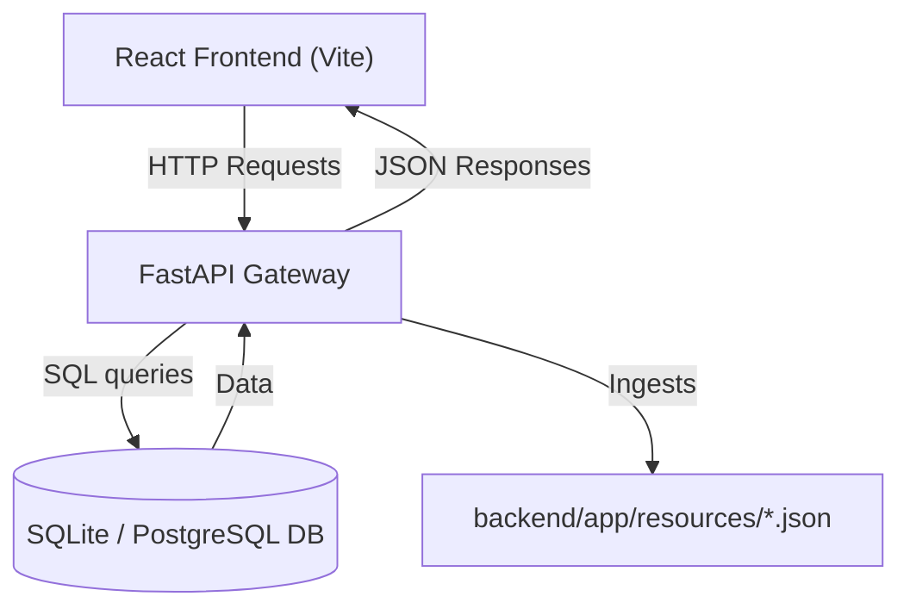
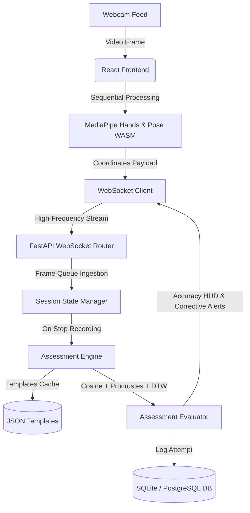
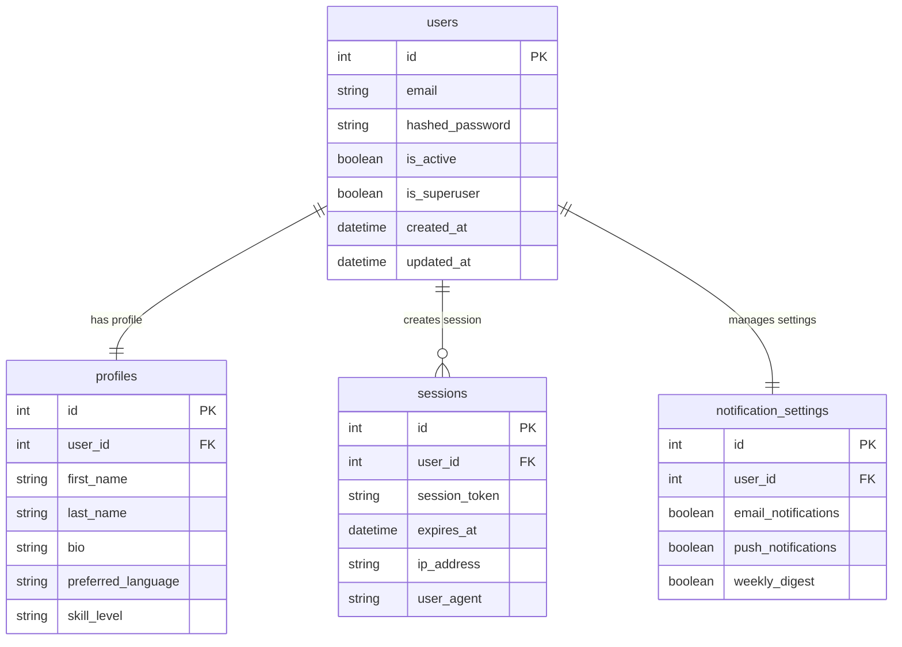
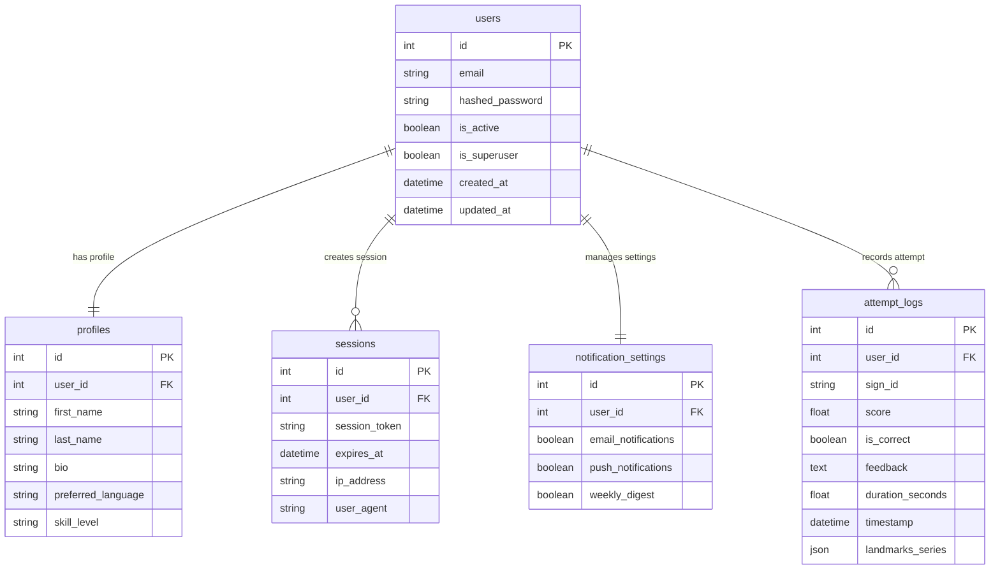
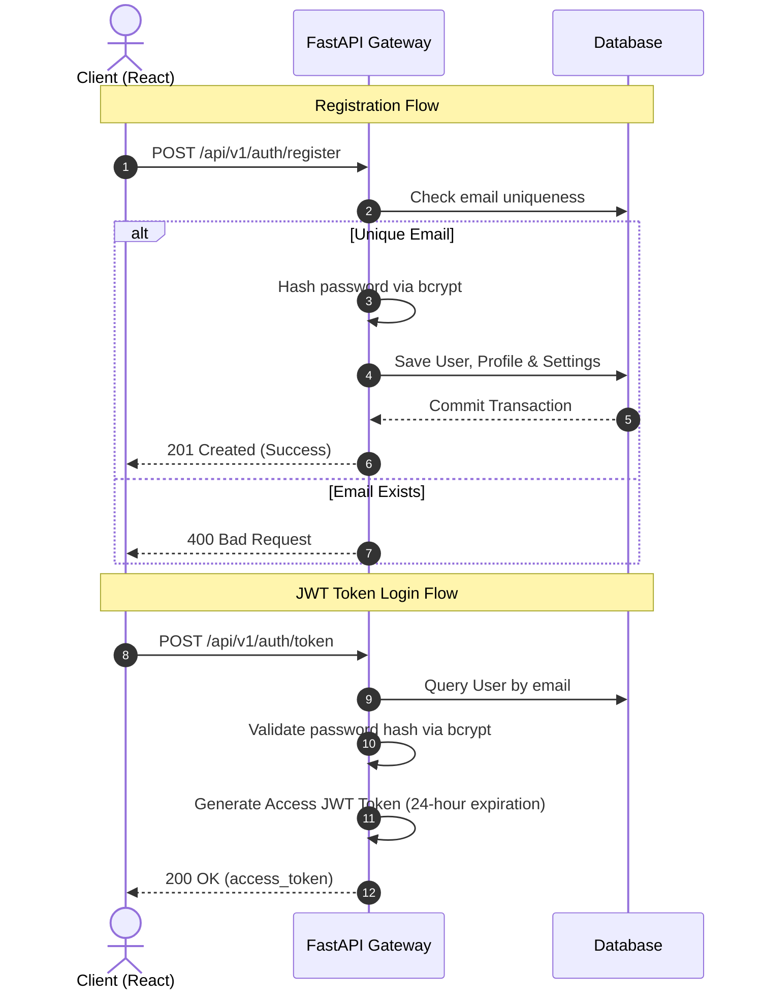
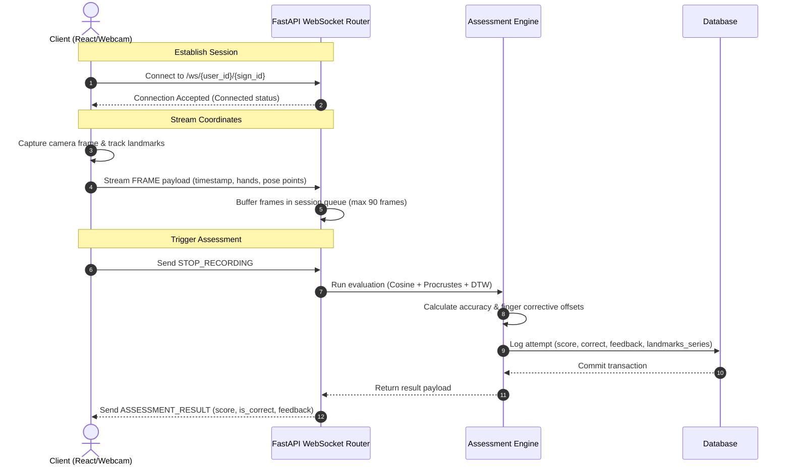

# SignLingo AI: Sign Language Learning & Assessment Platform

SignLingo AI is a modern web application designed to help users master American Sign Language (ASL) with real-time AI-based feedback. 

This repository contains the complete codebase for both **Milestone 1: Setup & Design** and **Milestone 2: Gesture Recognition & Assessment**.

---

## 1. System Architecture & Real-Time Data Flow

### A. High-Level Gateway Architecture
The platform follows a decoupled Client-Server architecture pattern:


### B. Real-Time WebSockets Ingestion Flow
The platform utilizes WebSockets to handle real-time sign recognition:


### C. Relational Database Model

#### 1. Milestone 1 Relational Database Model (4 Core Tables)
The initial database structure consist of four core tables:


#### 2. Milestone 2 Relational Database Model (5 Core Tables with Attempt Logs)
Milestone 2 expands the database schema to introduce the `attempt_logs` table:



---

## 2. Authentication & Data Flow

### A. Registration & Session Authentication Flow (Milestone 1)
Shows the user signup and OAuth2 JWT authentication flow:


### B. WebSockets Gesture Ingestion & Assessment Flow (Milestone 2)
Shows the real-time coordinate streaming, buffering, and AI evaluation sequence:


---


## 3. Tech Stack

- **Frontend**: React (v18), Vite, Tailwind CSS, Lucide Icons, `@mediapipe/hands`, `@mediapipe/pose`, `react-webcam`.
- **Backend API**: FastAPI (Python 3.11), Uvicorn, WebSockets.
- **Data Science**: NumPy, SciPy (v1.12+).
- **Database ORM**: SQLAlchemy (v2).
- **Security**: PyJWT, Bcrypt.
- **Unit Testing**: Pytest, HTTPX, FastAPI TestClient.

---

## 4. Completed Milestone Features

### Milestone 1: Core Setup & Authentication
- **Database Pooling**: Dynamic ORM session handling with an automatic local SQLite (`test.db`) fallback if PostgreSQL is offline.
- **User Dashboard**: Left sidebar layout featuring proficiency toggles, sliding stats, and role selectors.
- **JWT Auth**: Full OAuth2 flow (register/login) protecting user sessions.

### Milestone 2: Gesture Recognition & Assessment
- **Real-Time Hand Overlay**: Integrates `@mediapipe/hands` to track wrist, palm base, and 21 finger joints.Skeletons are overlayed using a cobalt-blue and emerald-green coordinate map.
- **Upper Body Pose tracking**: Integrates `@mediapipe/pose` sequentially to track shoulders, elbows, and arms, rendering them in violet.
- **Camera Controls**: Interactive camera **Enable/Disable** buttons with visual placeholder cards.
- **Pattern Matching Algorithms**:
  - **Cosine Similarity**: Identifies coordinate angle directions.
  - **Procrustes Shape Comparison**: Scale, translation, and rotation-invariant shape distance mapping.
  - **Dynamic Time Warping (DTW)**: Movement velocity matching for gesture sequences (e.g. dynamic words).
- **Corrective HUD Alerts**: Direct vector pointing evaluation (MCP to Tip) showing user exactly which finger needs correction.

---

## 5. Local Setup and Installation

### A. Run Backend API
Navigate to the `/backend` directory:
```powershell
python -m venv .venv
.\.venv\Scripts\activate
pip install -r requirements.txt
python -m uvicorn app.main:app --host 127.0.0.1 --port 8000 --reload
```

### B. Run Backend Tests
Run the pytest suite to verify routers, buffers, databases, and assessment engines:
```powershell
.\.venv\Scripts\pytest -v
```

### C. Run Template & Ingestion Simulation Scripts
To verify coordinate reference files or run a dynamic mock ingestion simulation:
```powershell
# Verify templates loading
python app/scripts/verify_templates.py

# Simulate perfect "drink" sequence stream (outputs 100%)
python app/scripts/test_dynamic_simulate.py
```

### D. Run Frontend Dev Server
Navigate to the `/frontend` directory:
```powershell
npm install
npm run dev
```
Open [http://localhost:5173](http://localhost:5173) in your browser.

