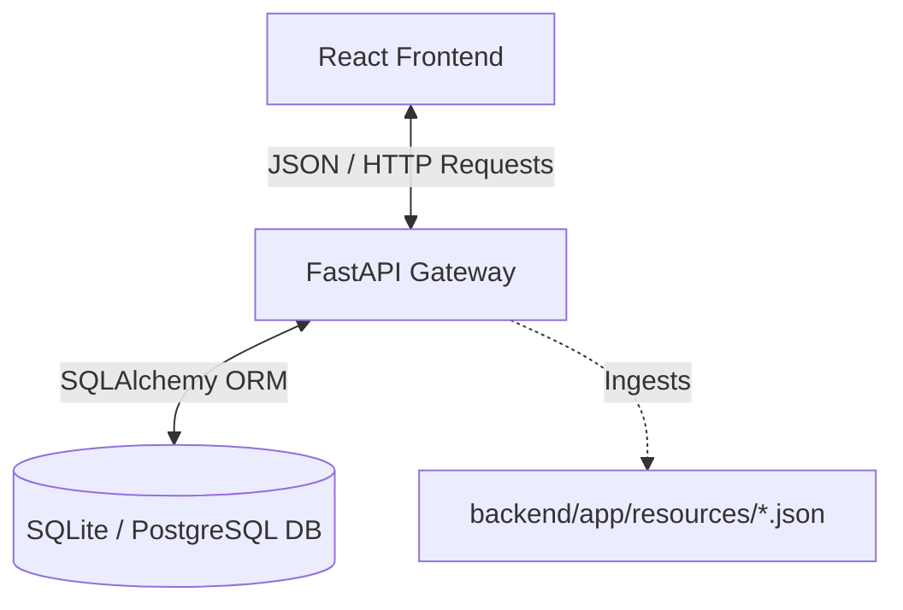
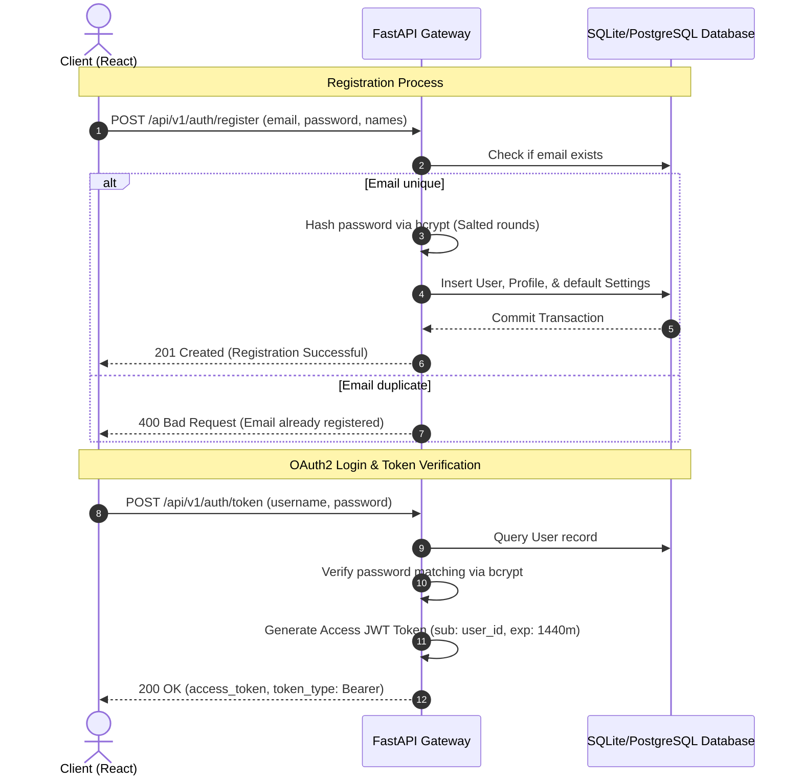

# Milestone 1: Technical Presentation & Speaking Script
This document serves as your complete guide for the Milestone 1 internship presentation. It includes the slide structure, visual diagrams, mapping of specifications, and a professional word-for-word script designed to impress evaluators.

---

## 1. Presentation Outline & Visual Diagrams

### Slide 1: Cover Slide
*   **Slide Title**: Sign Language Learning & Assessment Platform
*   **Subtitle**: Milestone 1: Architecture, Authentication & Core Setup
*   **Visual Elements**: Logos for React, FastAPI, PostgreSQL, and SQLite.
*   **Speaking Script**:
    > *"Good morning everyone. I am here to present the completion of Milestone 1 for the Sign Language Learning and Assessment Platform. Over this milestone, I established the foundation of our application—focusing on project initialization, modeling a relational database schema, implementing secure token-based authentication on the backend, and creating a premium, light-mode user interface shell on the frontend."*

---

### Slide 2: Project Architecture
*   **Slide Title**: Platform Architecture
*   **Visual Diagram (System Topology)**:

*   **Speaking Script**:
    > *"Let's examine the system's architecture. The platform operates on a classic decoupled Client-Server architecture. The frontend is built on React, which makes async HTTP calls to our FastAPI gateway on the backend. The backend utilizes SQLAlchemy to interact with the database. In our production environment, we use PostgreSQL, while our local development and automated testing utilize an isolated SQLite instance for fast initialization and testing."*

---

### Slide 3: Relational Database Model
*   **Slide Title**: Database Schema & Data Structures
*   **Visual Diagram (Entity Relationship)**:
```mermaid
erDiagram
    USERS ||--|| PROFILES : "has profile"
    USERS ||--o{ SESSIONS : "creates session"
    USERS ||--|| NOTIFICATION_SETTINGS : "manages settings"

    USERS {
        int id PK
        string email UNIQUE
        string hashed_password
        boolean is_active
        boolean is_superuser
        datetime created_at
        datetime updated_at
    }
    PROFILES {
        int id PK
        int user_id FK
        string first_name
        string last_name
        string bio
        string preferred_language
        string skill_level
    }
    SESSIONS {
        int id PK
        int user_id FK
        string session_token UNIQUE
        datetime expires_at
        string ip_address
        string user_agent
    }
    NOTIFICATION_SETTINGS {
        int id PK
        int user_id FK
        boolean email_notifications
        boolean push_notifications
        boolean weekly_digest
    }
```
*   **Speaking Script**:
    > *"This is our relational database schema. We modeled four tables. The Core 'users' table holds authentication credentials. We separated user properties into a 'profiles' table to keep the core credential table small and efficient. The 'sessions' table keeps track of active user tokens and device context. Finally, 'notification_settings' stores default user communication alerts. All related tables cascade on user delete to ensure data integrity."*

---

### Slide 4: Authentication & Security Flow
*   **Slide Title**: Secure Authorization Workflow
*   **Visual Diagram (Registration and JWT Token Validation)**:

*   **Speaking Script**:
    > *"This sequence diagram illustrates our user registration and token validation process. Password security is handled via direct bcrypt salting and hashing. When registering, the API checks for duplicates and inserts records across multiple tables inside a single committed database transaction. For login, we implement OAuth2 standard token routes. The API verifies the password, generates a signed JSON Web Token with a 24-hour expiration, and returns it to the client. The client stores this token in local storage to keep user sessions secure."*

---

### Slide 5: Frontend Design & Layout Shell
*   **Slide Title**: Light-Mode Frontend Design
*   **Visual Highlights**:
    *   **Off-white aesthetic**: Using Tailwind `slate-50` (`#F8FAFC`) background and white card overlays.
    *   **Role Grid Selector**: 2x2 interactive cards for Learner, Instructor, Accessibility Trainer, and Admin (scales up on select).
    *   **Dashboard Layout**: Left-hand navigation sidebar with active link indicators.
    *   **Profile Control Panel**: Multi-selection goal chips, proficiency toggles, and target hours slider.
*   **Speaking Script**:
    > *"Our frontend implementation strictly adheres to a premium, high-contrast light-mode design system. The registration form provides an interactive Role Selector grid, giving hover-state scale feedback as users select their profile type. Once logged in, they land on a responsive dashboard. The profile tab serves as our Learner settings panel, containing custom multi-select toggle chips for goals, proficiency level switches, and target practice hours range sliders."*

---

### Slide 6: Quality Assurance & Testing Outcomes
*   **Slide Title**: Quality Assurance & Verification
*   **Visual Highlights**:
    *   **Pytest Output**: 100% test success rate (`4 passed in 1.67s`).
    *   **Vite Bundle Output**: Optimized chunk outputs, compilation completed in `2.38s`.
    *   **Database Isolation**: Isolated SQLite mocks for unit tests.
*   **Speaking Script**:
    > *"Quality assurance is vital for our product. I implemented a backend test suite using pytest. The tests mock database instances locally on SQLite, verifying user creation, duplicate error handling, successful logins, and credential rejection. All tests passed successfully. Furthermore, we ran production builds on our Vite bundler to verify there are no CSS, syntax, or rendering conflicts. The build compiled successfully in under three seconds."*

---

### Slide 7: Next Steps & Future Scope
*   **Slide Title**: Next Steps: Milestone 2 & AI Training
*   **Visual Highlights**:
    *   **Google Colab**: Cloud GPUs to train landmark classification models.
    *   **MediaPipe Integration**: Extract coordinate maps of 21 hand joints.
    *   **Real-time HUD**: Skeletal canvas drawings on camera feed.
*   **Speaking Script**:
    > *"With our project initialization and authentication completed, we are ready for Milestone 2. In the next milestone, we will write Python scripts on Google Colab to train a model to recognize specific hand postures. We will integrate MediaPipe in the React browser to track 21 hand skeletal landmarks in real-time, displaying joint connections and calculating accuracy scores directly over the webcam feed. Thank you, and I am happy to open the floor to any questions."*

---

## 2. Technical Mapping of Milestone Requirements

| Specification / Requirement | Backend File | Frontend File | Status |
| :--- | :--- | :--- | :--- |
| **Relational Database Schemas** | [`models.py`](file:///d:/Infosys%20project/backend/app/db/models.py) | - | **Verified Complete** |
| **Pydantic Configurations** | [`config.py`](file:///d:/Infosys%20project/backend/app/core/config.py) | - | **Verified Complete** |
| **Registration / Login Endpoints** | [`auth.py`](file:///d:/Infosys%20project/backend/app/api/auth.py) | - | **Verified Complete** |
| **Secure Token Encryption** | [`security.py`](file:///d:/Infosys%20project/backend/app/core/security.py) | - | **Verified Complete** |
| **Premium Light-Mode Theme** | - | [`index.css`](file:///d:/Infosys%20project/frontend/src/index.css), [`tailwind.config.js`](file:///d:/Infosys%20project/frontend/tailwind.config.js) | **Verified Complete** |
| **Landing, Login, Register Pages** | - | [`LandingPage.jsx`](file:///d:/Infosys%20project/frontend/src/components/LandingPage.jsx), [`Login.jsx`](file:///d:/Infosys%20project/frontend/src/components/Login.jsx), [`Register.jsx`](file:///d:/Infosys%20project/frontend/src/components/Register.jsx) | **Verified Complete** |
| **Dashboard Layout Shell** | - | [`DashboardLayout.jsx`](file:///d:/Infosys%20project/frontend/src/components/DashboardLayout.jsx), [`App.jsx`](file:///d:/Infosys%20project/frontend/src/App.jsx) | **Verified Complete** |
| **Unit Test Coverage** | [`test_auth.py`](file:///d:/Infosys%20project/backend/tests/test_auth.py) | - | **Verified Complete** |

---

## 3. Anticipated Q&A (How to answer questions like a Senior Engineer)

1.  **Q: Why did you use SQLite for testing instead of PostgreSQL?**
    *   **A**: *"SQLite is an in-memory or single-file database that requires zero installation or network overhead. By using SQLite for unit tests, we can run our test suite instantly on any developer machine or CI/CD runner. We use environment variable injection to switch between SQLite for testing and PostgreSQL for production."*
2.  **Q: What password hashing standard did you use, and why did you bypass passlib's bcrypt backend?**
    *   **A**: *"We used direct bcrypt encryption. Modern versions of the bcrypt library (v4.0+) clashed with legacy passlib wrappers due to changes in version reporting attributes. To ensure stability and make the code future-proof, I bypassed passlib contexts in our security modules and implemented the verification directly via the standard python bcrypt package."*
3.  **Q: How does the application prevent duplicate registrations?**
    *   **A**: *"The `email` column in our `User` table is set with a `UNIQUE` index constraint in the database. During registration, the backend runs a query checking for existing matching emails. If a match is found, it raises a `400 Bad Request` HTTP exception. Even if two requests bypass this check concurrently, the database's unique constraint prevents duplicate insertion at the transaction level."*
