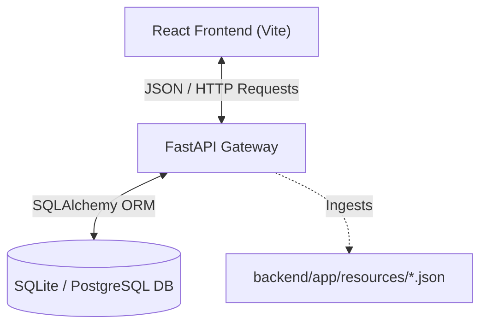
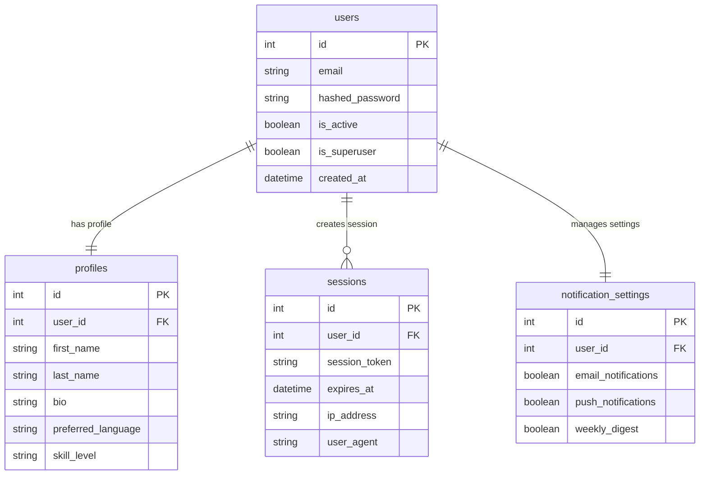
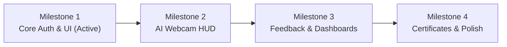

# SignLingo AI: Product Research, Architecture & Strategy Playbook

This playbook serves as a comprehensive reference guide for the **SignLingo AI** platform. It details user research, tech stack justifications, system architecture, database modeling, and the future milestone roadmap.

---

## 1. User Research & Audience Segmentation

To build an impactful accessibility platform, we segment our target audience into clear user personas:

### A. Primary Users (The Learners)
These are the users interacting directly with the real-time assessment interfaces to learn and practice sign language.

*   **ASL Student / Beginner**: Individuals who want to learn American Sign Language for personal interest, academic credits, or to communicate with friends, family, or colleagues.
    *   *Core Needs*: Structured, gamified lessons, immediate correction on hand shapes, and progress tracking (streaks and average accuracy).
*   **Deaf / Hard-of-Hearing (HOH) Children & Families**: Young learners and their hearing parents/guardians seeking a common, interactive medium to practice ASL together.
    *   *Core Needs*: Visual-first interfaces, highly engaging micro-interactions, and simple corrective prompts.
*   **Accessibility Practitioners**: Professional trainees (e.g., sign language interpreter trainees, special education teachers) who require high-precision assessments to test their gesture accuracy.
    *   *Core Needs*: Detailed joint-position feedback and quantitative accuracy metrics.

### B. Secondary Users (The Enablers)
These users coordinate the learning process, build educational content, or configure system tolerances.

*   **ASL Instructors / Educators**: Teachers who assign tasks, monitor student directories, and track class-wide success metrics.
    *   *Core Needs*: Student performance dashboards, class analytics, and the ability to upload or assign new vocabulary lists.
*   **Accessibility Trainers / Therapists**: Specialists who adjust system guidelines to accommodate motor control differences.
    *   *Core Needs*: Setting adjusters (e.g., motion damping, contrast modes, gesture error tolerance settings).
*   **Platform Administrators**: Technical managers maintaining platform security and content lists.
    *   *Core Needs*: Log access, course listing management, and system usage metrics.

---

## 2. Technical Stack & Architectural Rationale

Every technology selected for SignLingo AI was chosen to optimize performance, scalability, security, and developer experience.

### A. Backend: FastAPI (Python)
*   **Why we chose it**: 
    *   *High Performance*: Built on Starlette and Uvicorn, FastAPI matches the raw speeds of Node.js and Go.
    *   *Asynchronous Support*: Essential for handling concurrent WebSocket connections (planned for real-time model streaming in later milestones).
    *   *Pydantic Data Validation*: Enforces strict request/response data typing, preventing corrupted payloads from entering the database.
    *   *Self-documenting Swagger UI*: Instantly generates `/docs` endpoint documentation from Python type hints, speeding up frontend-backend integration.
*   **Why we rejected Django / Flask**: Django is excessively heavy for structured microservices, carrying unnecessary boilerplate (admin shells, template engines). Flask lacks native async execution and built-in type-checked request validation.

### B. Database ORM: SQLAlchemy (v2)
*   **Why we chose it**:
    *   *Decoupled Design*: Provides a strict separation between database schemas (Models) and query logic (Sessions), making it easy to swap engines.
    *   *Performance Optimization*: Leverages connection pooling and `pool_pre_ping` to detect and recover from dropped connections automatically.
*   **Why we rejected raw SQL / Django ORM**: Django ORM is tightly coupled to the Django framework. Raw SQL queries are highly vulnerable to SQL injection attacks and are difficult to maintain as schemas evolve.

### C. Databases: SQLite (Test) & PostgreSQL (Production)
*   **Why we chose it**:
    *   *SQLite*: Serverless, file-based SQL engine. It enables unit tests (`pytest`) to run locally with zero installation, starting and wiping database states in milliseconds.
    *   *PostgreSQL*: Production-grade, ACID-compliant relational engine. It excels at handling parallel writes and complex index filtering on user records.

### D. Frontend: React + Vite
*   **Why we chose it**:
    *   *Component-Driven Architecture*: Ideal for building reusable layout elements like custom buttons, sidebar navigations, and webcam canvases.
    *   *Vite Build Engine*: Replaces slow Webpack bundlers with native ES modules, compile-building production code in under 3 seconds.
*   **Why we rejected Angular / Vue**: Angular has a steep learning curve and excessive structural constraints. React has a massive ecosystem of computer vision packages (such as MediaPipe wrappers) which will be critical in Milestone 2.

### E. Styling: Tailwind CSS
*   **Why we chose it**:
    *   *Utility-First Design*: Allows creating premium, glassmorphic headers and responsive grids directly in the JSX files without writing thousands of lines of raw CSS.
    *   *Purge Engine*: Drops unused CSS selectors during compilation, reducing our stylesheet file size to under 20KB.

---

## 3. Relational Database Schema Model

The database is designed with modularity in mind. User security credentials are isolated from profile details to ensure high-performance querying:

---

## 4. Milestone Implementation Roadmap

SignLingo AI's development is structured in 4 key milestones, progressing from system foundation to real-time AI classification:

### Milestone 1: Project Initialization & Core Setup (Current)
*   **Focus**: System infrastructure and authentication.
*   **Key Deliverables**: Relational database tables, JWT login/registration APIs, floating glassmorphic navbar, role-selection grids, and a profile customization panel.

### Milestone 2: Gesture Sandbox & Real-Time HUD (Next)
*   **Focus**: Computer vision and client-side model execution.
*   **Key Deliverables**:
    *   **Google Colab Training**: Ingest ASL Alphabet datasets and train a classifier model using coordinates extracted from hand tracking.
    *   **Webcam Canvas**: Integrate `react-webcam` with HTML5 canvas.
    *   **MediaPipe Integration**: Draw 21 hand joints on screen.
    *   **Real-time HUD**: Render a circular progress bar displaying matching accuracy percentages.

### Milestone 3: AI Feedback Alerts & Custom Dashboards
*   **Focus**: Role-based routing and corrective user experience.
*   **Key Deliverables**:
    *   **Webcam Feedback Banner**: Real-time alerts (e.g. *Rotate wrist slightly*) based on model feedback.
    *   **Learner Dashboard**: Interactive progress line graphs and streak trackers.
    *   **Instructor Portal**: Student progress data tables.
    *   **Accessibility Portal**: Damping and contrast adjusters.

### Milestone 4: Certificate Modal & Final Polish
*   **Focus**: Certification, reporting, and smooth transitions.
*   **Key Deliverables**:
    *   **Certificate Modal**: Ivory-themed popup with decorative borders and PDF download actions upon course completion.
    *   **Report Export Center**: CSV/PDF data extractors for student lists.
    *   **UX Polish**: Modern hover-lift animations and page transitions.
